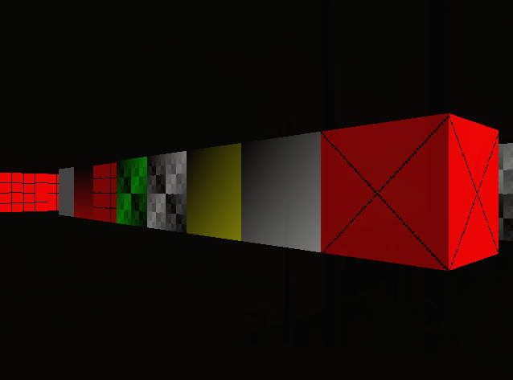

# Wolfenstein-style software renderer

written with C and SDL2.

Heavily used https://lodev.org/cgtutor/raycasting.html as a resource.
Also used https://github.com/jdah/doomenstein-3d/tree/main by jdh, but mostly just used his Makefile. I also used a macro or two of his, but most of my code is my own.

I've only tested this on Linux, not Mac, and it definitely won't work on Windows.

`./src` contains my own dynamic array implementation, `main_wolf.c`, and a `sdl_demo.c`, an SDL demo program I used for early
testing.

### Building and running
`$ make all` to build

`$ ./bin/wolf` to run
